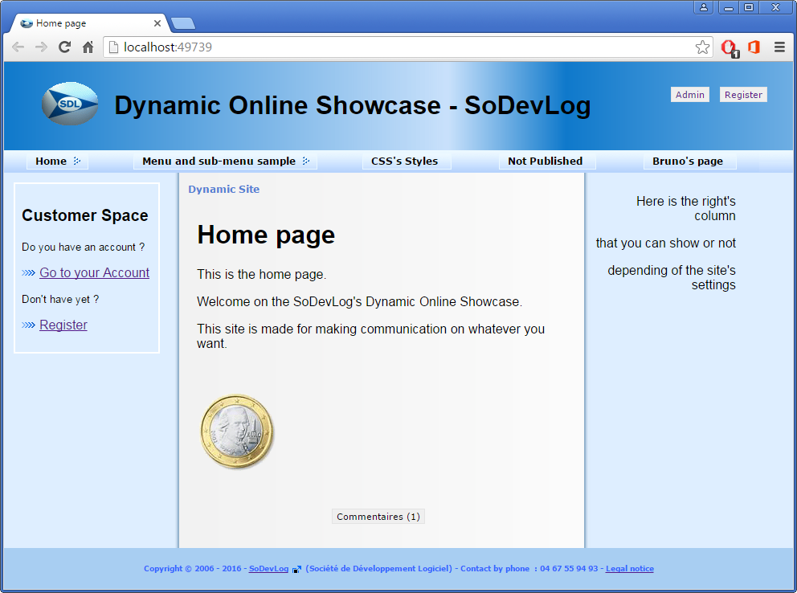

# WebApp Dynamic ShowCase
This application is a web site an ASP.NET Application that **dynamicly present content into pages** that you can organise in a user's menu.
This project is managed by Mabyre who is a member of the company SoDevLog.

# Requirements
* Visual Studio 2017 +
* ASP.NET 4.5 +
* SQLServer

# Getting started
1. Clone repository
1. Open solution in Visual Studio 2013 or more
1. Builld and Run solution to load website in the browser
1. Use **admin/admin** to log into website administration

You will see the front page :

This will be developped

[Dedicated blog](https://dynamic-showcase.sodevlog.com/)

## So we stay tuned
